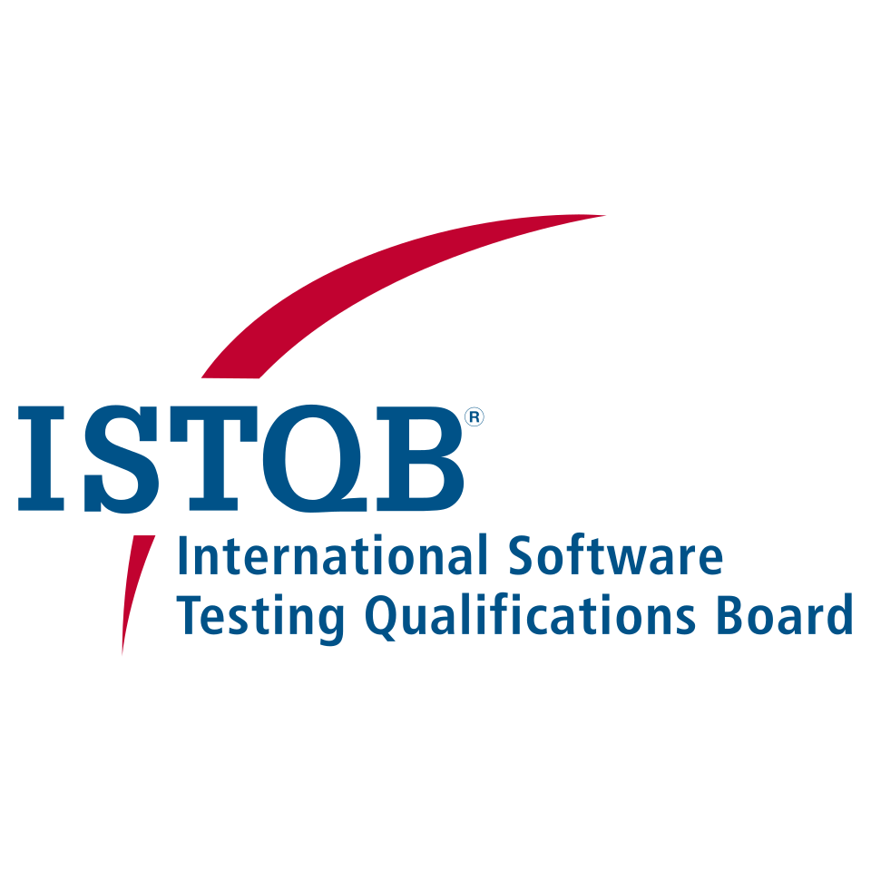
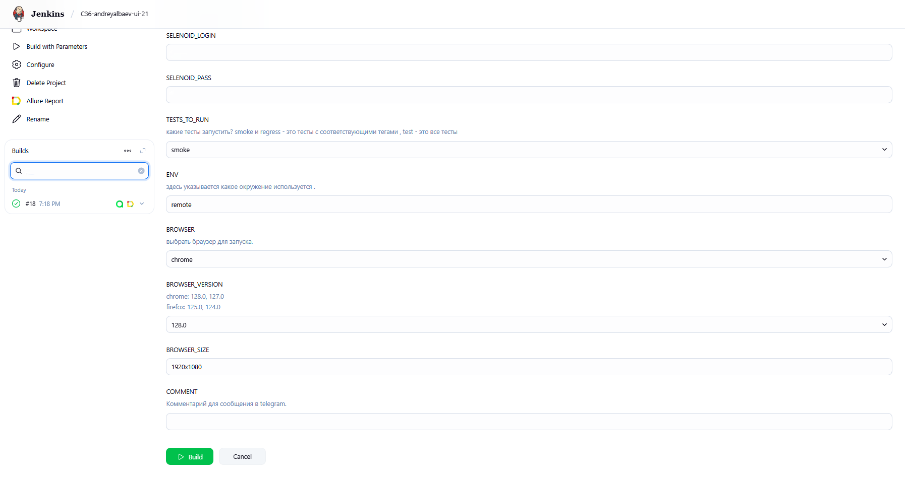
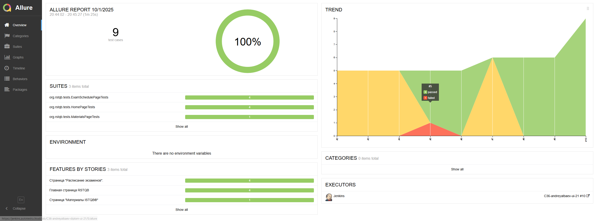
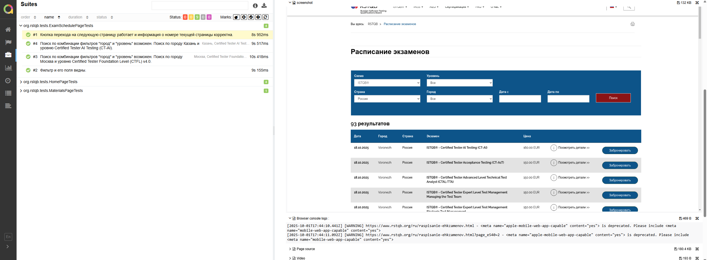
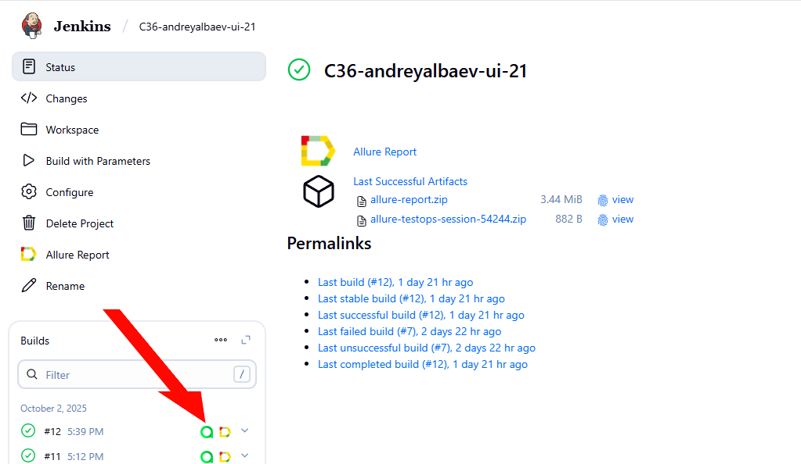
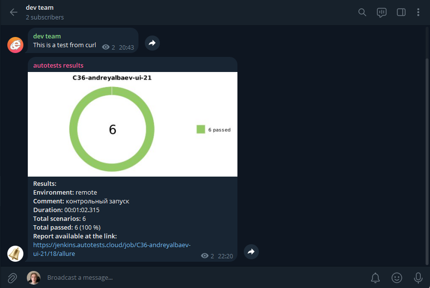

<div align="center">

# Проект UI автотестов для сайта RSTQB


</div>

> **RSTQB** —  это ISTQB в России.
> 
> **ISTQB** (International Software Testing Qualifications Board) — международная организация, занимающаяся разработкой и утверждением стандартов в области тестирования программного обеспечения.

---
## 📖 Содержание

- [🧩 Используемые технологии в проекте](#технологии)
- [🧪 Тест-кейсы](#тест-кейсы)
- [🚀 Запуск автотестов через терминал](#запуск-автотестов-через-терминал)
- [⚙️ Сборка Jenkins](#сборка-jenkins)
- [📊 Allure](#allure)
- [📊+🧪 Allure TestOps](#testops)
- [🔔 Telegram](#telegram)

---
<div align="center">

<a id="технологии"></a>
## Используемые технологии в проекте

<p  align="center">

      
  
  
  
  
  
  
  
  
  
  

</p>
</div>


---

<a id="тест-кейсы"></a>
## 🧪 Тест-кейсы

### Главная страница
 - ✅ Проверка видимости логотипа.
 - ✅ Кнопка "Поиск" перебрасывает на страницу "Расписание экзаменов".
 - ✅ Поиск по дате работает.

### Страница "Материалы ISTQB®"
 - ✅ PDF скачивается, соответствующий текст в PDF присутствует.

### Страница "Расписание экзаменов"
- ✅ Поиск по комбинации фильтров "город" и "уровень" возможен.
- ✅ Кнопка перехода на следущющую страницу.
- ✅ Фильтр и его поля видны.


___
<a id="запуск-автотестов-через-терминал"></a>
## 🚀 Запуск автотестов через терминал

### Запустить все тесты локально 

```bash
  ./gradlew clean test
```
Также есть возможность вместо **test** указать **smoke** или **regress** и запустятся соответствующие тесты 🤖


### Запустить все тесты удалённо (на selenoid сервере)

```bash
  ./gradlew clean -DselenoidLogin={LOGIN} -DselenoidPass={PASS} test
```

Вместо {LOGIN} и {PASS} необходимо подставить креды от selenoid.

### Получить Allure отчёт

```bash
  ./gradlew allureServe
```

после запуска команды в консоли появится ссылка, останется на неё нажать, чтобы открыть отчёт.
___

<a id="сборка-jenkins"></a>
##  </a> Сборка в <a target="_blank" href="https://jenkins.autotests.cloud/"> Jenkins </a>
Jenkins job-а для запуска автотестов этого проекта располагается <a target="_blank" href="https://jenkins.autotests.cloud/job/C36-andreyalbaev-ui-21"> здесь</a>. Для запуска сборки необходимо нажать на <code>Build with parameters</code>, выбрать необходимые параметры и нажать кнопку <code>Build</code>.

### Параметры сборки в Jenkins:

- SELENOID_LOGIN
- SELENOID_PASS
- TESTS_TO_RUN
- ENV
- BROWSER_VERSION
- BROWSER_SIZE
- COMMENT

<div align="center">



</div>


❗После выполнения сборки формируются <code>Allure Report</code> - HTML отчёт о прошедших тестах и тестовые прогоны в TMS <code>Allure TestOps</code>.

---
<a id="allure"></a>
##  </a>  Allure
### Пример отчёта



Как уже было сказано ранее, отчёт формируется автоматически после прогона автотестов.

### Allure attachments

Также после выполнения тестов к отчёту добавляются:

1) Скриншот окна перед закрытием драйвера
2) Логи консоли браузера
3) HTML страницы перед закрытием драйвера
4) Видео выполнения автотеста

На скриншоте ниже это видно в правой части экрана.



---
<a id="testops"></a>
##  </a>  Allure TestOps
Это TMS, которую можно интегрировать, например, с Jenkins и Jira, в данном проекте интегрировано с Jenkins: в TestOps автоматически выгружаются результаты прохождения автотестов после выполнения job-ы в Jenkins.

<div align="center">


</div>
<div align="center">


</div>

---

<a id="telegram"></a>

##  </a>  Telegram уведомления
К проекту также подключен бот , который по завершении прогона автотестов посылает краткую сводку и ссылку на allure отчёт в telegram<a target="_blank" href="https://t.me/esttonami"> чат</a>.


<div align="center">


</div>
